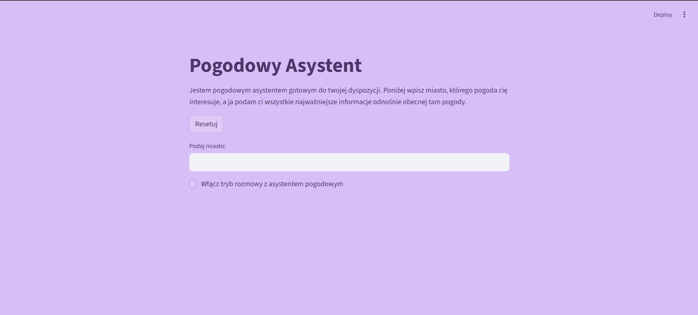
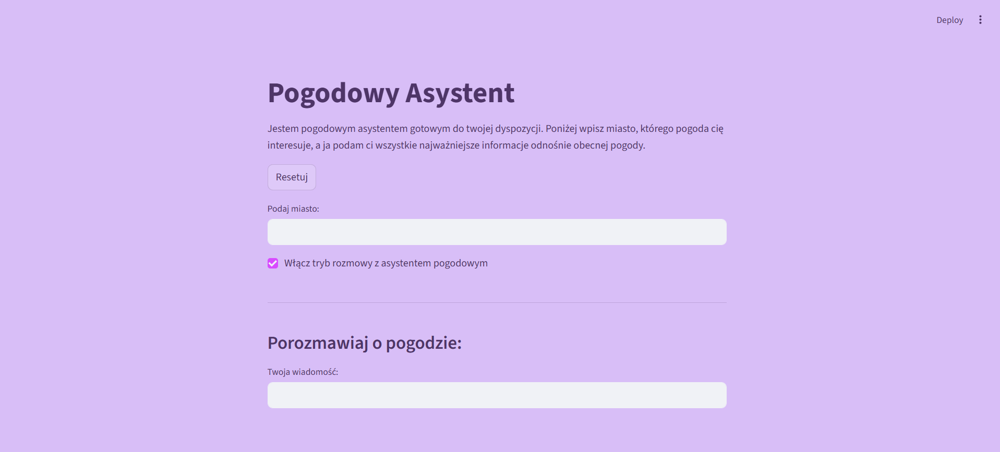

# Aplikacja Pogody

To aplikacja stworzona w **Streamlit**, która pobiera aktualne dane pogodowe z **OpenWeatherMap** i pozwala na rozmowę z botem AI na temat pogody w dowolnym mieście.


## Jak działa

Po uruchomieniu aplikacji wyświetla się strona internetowa **"Pogodowy Asystent"**, na której znajduje się informacja, jak działa strona.

<p align="center">
  
</p>

Poniżej wyświetla się pole do wpisania nazwy miasta. Po wpisaniu nazwy miasta zostają pobrane dane z **OpenWeatherMap**, zawierające informacje o:

- temperaturze 🌡️,  
- ciśnieniu 💨,  
- prędkości wiatru 🍃,  
- zachmurzeniu 🌤️,  
- wilgotności 💧.  

Te dane trafiają do interpretacji bota AI, który generuje odpowiedź opisującą pogodę w danym mieście.  

Pod polem do wpisania nazwy miasta znajduje się przycisk:

**"Włącz tryb rozmowy z asystentem pogodowym"** – po jego kliknięciu pojawia się pole do zadawania pytań dotyczących pogody, na które bot AI generuje odpowiedzi.  

Na stronie znajduje się również przycisk **"Resetuj"**, który:

- czyści całą konwersację z botem AI,  
- usuwa wpisaną nazwę miasta.  

<p align="center">
  
</p>

## Wymagania
Aby aplikacja sprawnie działała należy mieć:
1. Wersję Python 3.10 i nowsze 
2. Zainstalowane paczki:  
  - `streamlit`  
  - `requests`  
  - `os`  
  - `openai`  
  - `python-dotenv`

3. Dodatkowo potrzebne są klucze API:

- `OPENAI_API_KEY` – klucz OpenAI  
- `API_KEY` – klucz OpenWeatherMap
  
  które należy dodać do pliku `.env`.

---

### Komenda uruchamiająca aplikację

W terminalu wpisz:

```bash
streamlit run weather_app.py --server.port 8501
